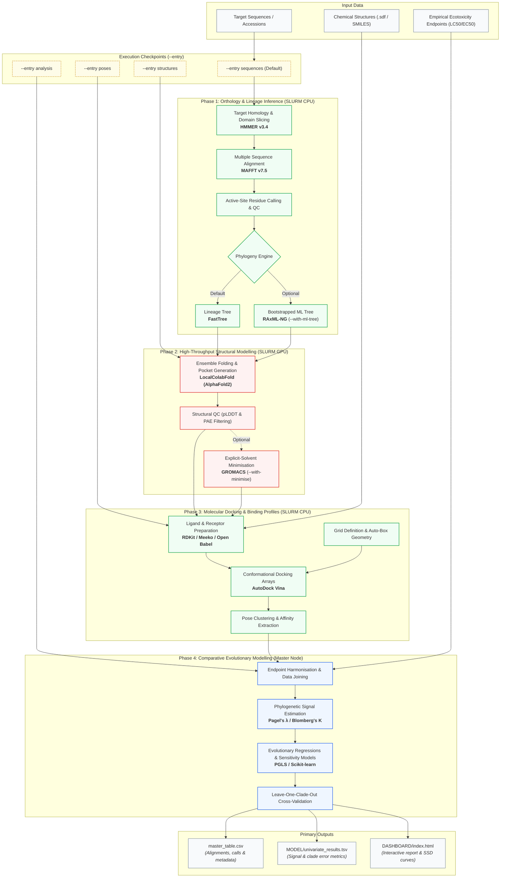

# SENTINEL

**Species Sensitivity from Target Interaction and Evolutionary Lineage**

SENTINEL models cross-species chemical susceptibility by tracing evolutionary divergence in xenobiotic target proteins. By integrating comparative sequence analysis, 3D structural modelling, and binding simulations, the workflow translates molecular initiating events (MIEs) into predictive Species Sensitivity Distributions (SSDs) across uncharacterised taxa.

The pipeline is engineered for SLURM-managed HPC clusters, distributing GPU-accelerated structural predictions and parallel CPU tasks across cluster nodes.

---

## Pipeline Architecture



---

## Quickstart

### 1. Environment Setup

```bash
git clone https://github.com/krishnan-Rama/SENTINEL.git
cd SENTINEL

conda env create -f environment.yml
conda activate sentinel
```

Verify binary discovery, cluster modules, and CLI accessibility:

```bash
bin/sentinel --help
bin/sentinel doctor
```

### 2. Configuration and Submission

All target specifications, active-site boundaries, ligand paths, and compute parameters are configured in a project environment file.

```bash
# Prepare a run profile from the template
cp config/project.env config/my_run.env
$EDITOR config/my_run.env

# Validate inputs and inspect the execution plan
bin/sentinel -c config/my_run.env -n run

# Dispatch array jobs to SLURM
bin/sentinel -c config/my_run.env \
    --hpc slurm \
    --partition standard \
    --gpu-partition gpu \
    --account proj123 \
    run
```

---

## Command-Line Interface

```text
bin/sentinel -c <config.env> [OPTIONS] <COMMAND>
```

### Commands

* `run`: Execute the planned pipeline workflow.
* `doctor`: Audit environment modules, external binaries, and input file integrity.
* `--help`: Display the CLI syntax and default arguments.

### Pipeline Execution Options

* `-n`: Dry-run mode. Displays planned execution steps and task counts without dispatching jobs.
* `--entry <STAGE>`: Resume or start from intermediate checkpoints.
* `--force`: Disregard cached outputs and force recomputation of downstream stages.
* `--with-ml-tree`: Infer a maximum-likelihood phylogeny via RAxML-NG instead of FastTree.
* `--with-minimise`: Execute explicit-solvent energy minimisation via GROMACS prior to docking.

### SLURM Resource Flags

* `--hpc slurm|local`: Execution mode (default: `local`).
* `--partition <NAME>`: CPU partition for sequence alignment, tree inference, and docking.
* `--gpu-partition <NAME>`: GPU partition for ColabFold structural predictions.
* `--account <NAME>`: SLURM project allocation code.
* `--max-parallel <N>`: Maximum number of concurrent array tasks.
* `--threads <N>`: Number of CPU threads per task.

---

## Modular Entry Points

Use `--entry` to resume from intermediate checkpoints or inject existing structural data. Completed stages are cached automatically.

| Current Data State | Command | Scope of Execution |
|---|---|---|
| Species accessions and endpoints | `--entry sequences` (default) | Executes full pipeline from alignment onward. |
| Precomputed 3D structures | `--entry structures --models <DIR> --alignment <FILE>` | Skips ColabFold; proceeds to docking. |
| Docked receptor-ligand poses | `--entry poses --docked <DIR> --alignment <FILE>` | Skips docking; extracts descriptors and fits models. |
| Feature matrices and affinities | `--entry analysis` | Executes regressions, phylogenetic models, and report generation. |

---

## Primary Outputs

All generated artefacts are written to the directory specified by `--outdir` in your configuration file:

* `master_table.csv`: Consolidated dataset of sequence accessions, active-site residue calls, orthologue validation, and harmonised endpoints.
* `MODEL/univariate_results.tsv`: Statistical summaries per descriptor, including phylogenetic signal (Pagel's lambda) and leave-one-clade-out cross-validation error.
* `DASHBOARD/index.html`: Self-contained interactive report displaying structural alignments, binding poses, and predicted SSD curves.

---

## Contact

Rama Krishnan  
School of Biosciences, Cardiff University  
Email: krishnanr1@cardiff.ac.uk
